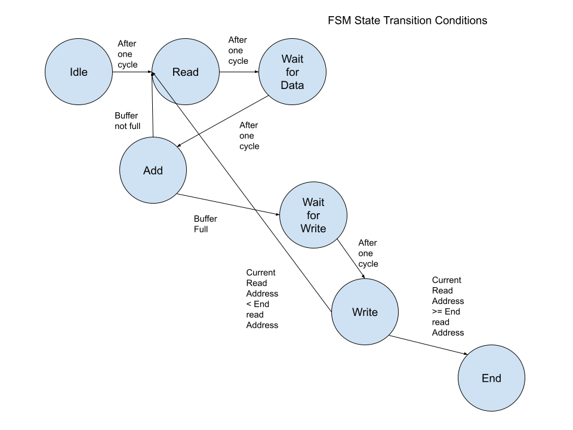
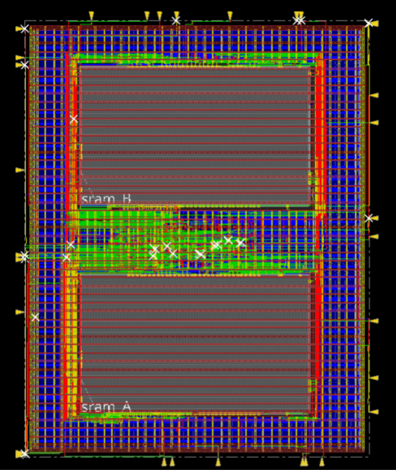

**Project**: 64 bit adder ASIC

**Description:** Silicon Jackets Digital Onboarding Project. Consisted of a digital design, verification, and physical design stage

**Dates:** Sep 25 \- Oct 25

---

The goal of the digital design portion of the onboarding was to write the RTL for a 64 bit adder that read from and wrote to memory. 

I first designed a finite state machine diagram, then implemented the FSM in System Verilog. I used Cadence SimVision to debug the waveforms

At first, we were to use a simple, pre-made testbench to verify functionality. During the DV portion of the onboarding, I designed my own testbench, verifying memory transactions against a golden reference model. To reach full code coverage, I generated constrained random stimuli and wrote stimuli to handle all edge cases. I also learned how to write assertions to validate that specific functionalities were working. We were to use Synopsis Verdi to verify at least 96% code coverage; I achieved 99.7% coverage.

In the physical design portion, we used the silicon jackets flow tool to complete layout. I learned how to write TCL scripts to automate certain processes, like placing the SRAM Macros. I also learned about Static Timing Analysis and Design Rule Checking

