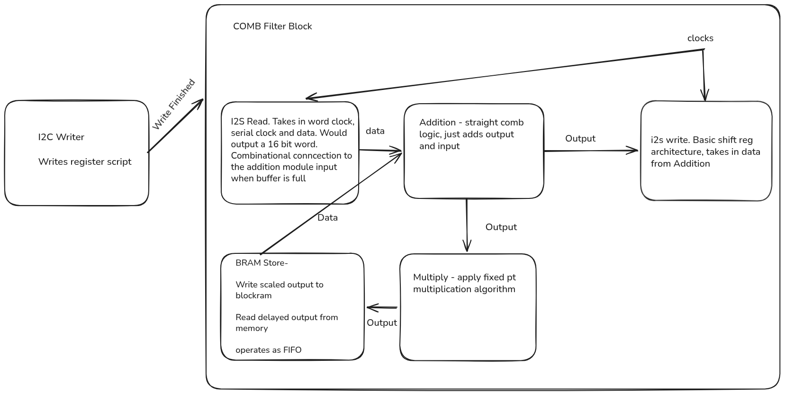
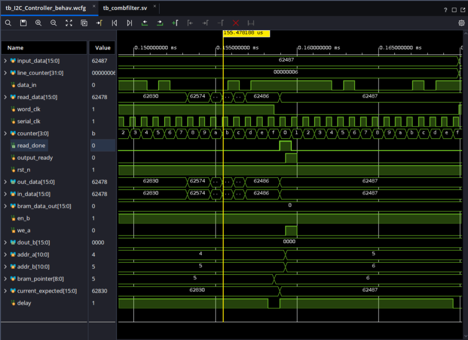

**Project**: FPGA Comb Filter with I2S Read and Write modules

**Description:** Design, Verify, and Implement RTL to read data from TLV320AIC3104 Audio Codec, process through a feedback comb filter, and output back in to the DAC of Codec.

**Dates:** Jun 26 \ Jul 26

**Technologies:** Vivado, SystemVerilog 

<b>Repo:</b> <a href="https://github.com/tejusk2/I2CModuleAUPZU3" target="_blank">https://github.com/tejusk2/I2CModuleAUPZU3</a>

---

Building on my I2C Controller, I decided to write some more RTL involving the TI audio codec. The objective is to recieve data from the ADC, run it through a feedback comb filter, and then pass the data back into the DAC. This involves learning another communication protocol(I2S), fixed point binary math, and interfacing with Block RAM. Comb filters are really cool because they can be used as a building block for a ton of different audio effects; see the video at the end, which shows a flanger built off of my comb filter

Hardware I’m working with: TLV320AIC3104 Texas Instruments Audio Codec, AUP-ZU3 board (AMD Zynq UltraScale+ MPSoC). 

Comb filter difference equation: y[n] =  x[n] + a*y[n-k]

The first thing I did was create a system diagram and plan the top level functionality.

After the I2C register write is complete, the top level module will enable the filter controller. I2S Read is clocked by the bit clock and collects a 16 bit input word. The output of I2S read is added with the delayed and attenuated output, stored in block RAM. This output is sent to the I2S write module, and also stored in memory.

To start, I wrote a matlab script to simulate how the filter would work at a system level, and generated stimulus files to use in the testbench
From there, I wrote a system level testbench, which verified the DUT's output against a reference model, and generated inputs from our stimulus file.

This stage of the process took relatively little time, as I2S was an easy communication protocol to learn and the filter behavior was relatively straightforward. 

Once this was done, it was on to another time consuming part of the project, register programming. Previously, I designed an I2C write controller, which I'll use to program the registers on the Codec. I went through the entire register map datasheet and a wrote a script for everything I need, this included routing signals, powering up and unmuting outputs, DAC, ADC, and PGA. It also required enabling the codec's internal phase locked loop and setting the speed of that to create a 44.1Khz sampling frequency reference signal to use for I2S Communication.

The final part of the process was implementation. I used Internal Logic Analyzers in Vivado to debug the clock, input and output waveforms. The ILA's helped debug tiny errors in my RTL and contraints, like my output and input being switched, and the I2S clocks being the wrong speed.

I also had to rewrite my I2S read module to align itself after every clock word clock transition. Aditionally, I learned that I had to specify that my fixed point multiplication was between two signed numbers. After these fixes, I got a working Comb Filter.

The comb filter is a good building block for a lot of other audio effects. One I really liked the sound of was a flanger, which varies the delay of the comb filter, chaging it's harmonics. 

I implemented this quite easily by adding a linearly oscillating delay variable to the filter controller. The delay changes from 1 to 10ms in 2 seconds. Below is what the results sounds like(I ran it through a BP filter in matlab to get rid of some background sounds, like my washing machine)

<audio controls>
    <source src="image_gallery/fureliseflanged.wav" type="audio/wav">
</audio>

This project was a really fun look into how signal processing is done on FPGAs.