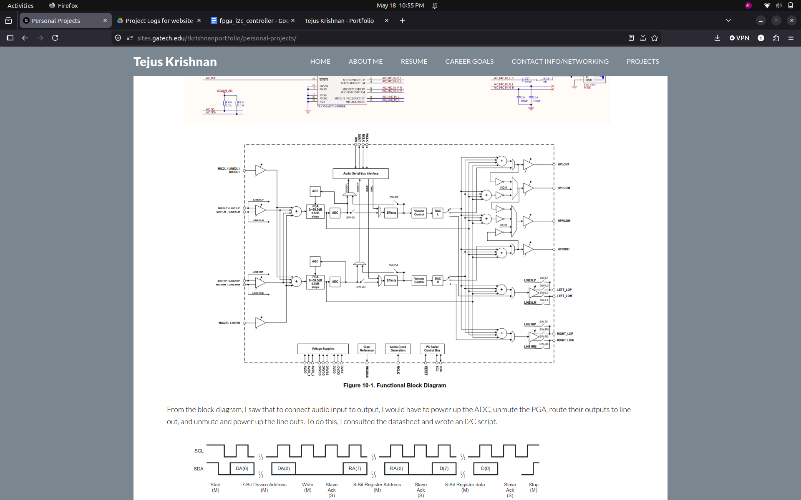
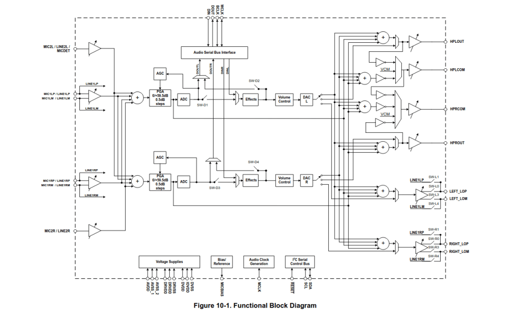
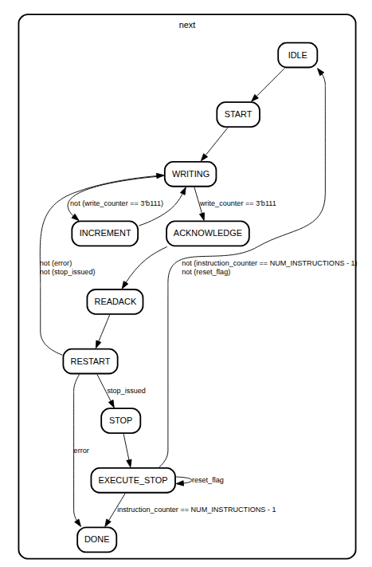
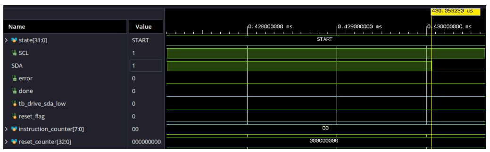
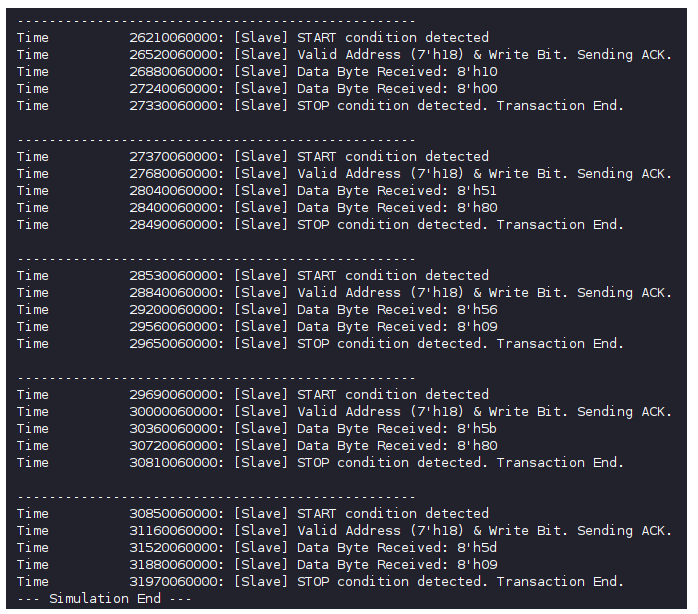
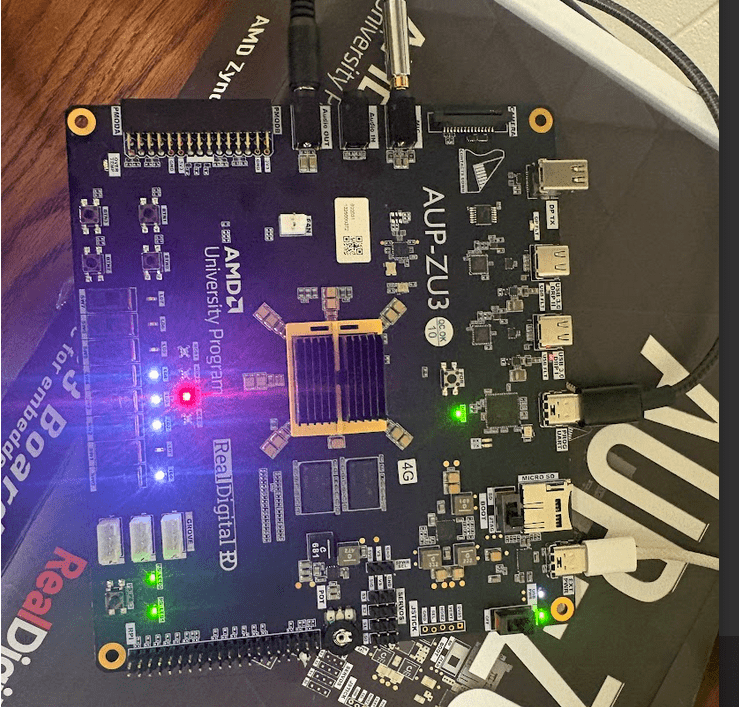

**Project**: FPGA I2C Write to TI Audio Codec

**Description:** Design, Verify, and Implement RTL to change register data in the TLV320AIC3104 Audio codec on an AUP-ZU3 board. Discovery Project for GT’s ECE 1100 Class.

**Dates:** Mar 26 \- Apr 26

**Technologies:** Vivado, SystemVerilog 

<b>Repo:</b> <a href="https://github.com/tejusk2/I2CModuleAUPZU3" target="_blank">https://github.com/tejusk2/I2CModuleAUPZU3</a>

---

My ECE1100 Discovery Project was to write digital hardware to play sounds on utilizing my FPGA. Due to some difficulties, I narrowed the scope of my project to an I2C module that configures registers in an on board Audio Codec. To test if my module worked, I chose the simplest option and wrote an I2C script that would route the analog input straight to the output, bypassing the DAC on the Audio Codec

Hardware I’m working with: TLV320AIC3104 Texas Instruments Audio Codec, AUP-ZU3 board (AMD Zynq UltraScale+ MPSoC). Codec Functional Diagram and Board Schematic I reference down below:

From the block diagram, I saw that to connect audio input to output, I would have to power up the ADC, unmute the PGA, route their outputs to line out, and unmute and power up the line outs. To do this, I consulted the datasheet and wrote an I2C script.

To actually write the I2C Controller, I looked at the datasheet’s I2C timing diagram and used AI to build a preliminary test bench. I first designed a state machine: 

I implemented this in System Verilog with a sequential block for signal logic and combinational block for next state logic. Once I learned more about the communication protocol, I modified the testbench to make it more closely mimic the audio codec.

In the start state, the controller pulls down the data line while clock is high, which triggers a start condition and makes all devices on the line start listening.

A big issue I had in the RTL design phase was data validity. I kept triggering stop conditions by changing data while clock was high, and my logic for triggering a stop was flawed. I changed my controller to only change data during the low clock edge, and I split the stop into two states. The first would pull the line down after our controller had read the acknowledge, and the second would release the data line and trigger a stop during the clock’s high period. 

Above is part of the console output for my behavioral simulation. Once I had the correct output, it was time to actually implement

This step was the hardest and most time consuming, as even though my module worked in simulation, it wouldn’t work right away in real life. First, I designed a top level controller and hooked up the inputs and outputs to this module to physical pins on the board in a constraints file.

I spent a lot of time debugging my I2C script, which I had implemented in read only memory, but the problem was my actual I2C Controller was faulty. First, the codec has to take time to power up after the hardware and software reset, but I hadn’t accounted for that. My fix was to simply add a delay counter to the beginning and after the 5th write. Another problem was that I sampled the data line for acknowledge far before the codec could pull it down, this meant that even if my controller didn’t work and the codec sent a NACK, it still looked like my I2C controller was working. This caused a lot of wasted time looking at other issues. The fix was simple: I changed my controller to sample the data line during the high edge of the next clock cycle, which is when it should be sampled.

The controller now sampled during the halfway period of restart, instead of acknowledge. If it saw that the data line was still high, it would flag an error and immediately move to a done state. Now, I was able to see that my controller wasn’t actually working. All I had to do to fix that was to add in a couple signals into reset that I had forgot. The last part of the project was actually writing the I2C script to route the input to the output, which took a considerable amount of time as I had to comb through the datasheet to figure out what registers were necessary to change.

The RED led is tied to the done signal, which goes high when the I2C controller has finished writing. The error LED is off and the white LED’s below are tied to the 7 bits of the instruction counter, this configuration shows 29, which means that all 30 bytes have been sent successfully.

To test that it worked, I connected the input to my laptop, and the output to speakers. The speakers played the sound out through my laptop, indicating that the correct registers had been changed and my RTL worked. 