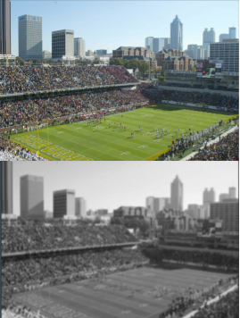

**Project**: Hardware Accelerated Gaussian Blur

**Description:** Project to introduce myself to GPU programming by accelerating an image processing algorithm

**Dates:** Oct 25

**Libraries:** OpenCL, Intel Intrinsics

<p><b>Repo:</b> <a href="https://github.com/tejusk2/hw_accelerated_image_filtering" target="_blank">https://github.com/tejusk2</a></p>


---

To start, I developed a gaussian blur algorithm in C++, this involved grayscaling-\>generating a gaussian kernel the same size as the image-\>fft on the image-\>element-wise multiplication of the kernel and the frequency domain of the image-\>inverse fft.

This naive implementation took 72 seconds to run.

The image was 2464 \* 1648, so more than 4 million pixels in total. A lot of the above workload could be parallelized

The first thing we needed to do was setup buffers and copy over the data to the device. The large amount of data creates a pretty significant overhead. 

**Optimization 1 \- grayscale**: 1-D kernel grid, averaged three color channels using each work item as an index

**Optimization 2 \- kernel generation**: As OpenCL is setting up, I multithreaded the Gaussian Kernel Generation on the CPU. I also wrote 512 bit instructions for some of the steps in this process using the Intel Intrinsics library, but it ended up being slower than the compiler optimized instruction

**Optimization 3 \- Padding:** To zero pad the matrix for fft, I generated a zero matrix of 2^n, where n is the closest integer larger than the total image size. I used the GPU to copy over data from the grayscale matrix to this matrix, utilizing a 2D kernel grid this time

```cpp
__kernel void normalize(__global const unsigned char *gray, __global double *real,
                        const unsigned int width,
                        const unsigned int pad_w,
                        const unsigned int height){
    int x_idx = get_global_id(0);
    int y_idx = get_global_id(1);
    if (x_idx < width && y_idx < height) {
        real[y_idx*pad_w + x_idx] = (double)gray[y_idx*width + x_idx];      
    }              
}    
```

**Optimization 4 \- FFT:** Originally, I was using a recursive FFT algorithm on both the gaussian kernel and the grayscale\_matrix. Because recursion isn’t parallelizable, I switched to an iterative radix 2 FFT with bit reversal. FFTs are able to sample and represent polynomial functions from its even and odd induced terms. Since those even and odd polynomials can be further broken down, the fft becomes a divide and conquer algorithm. The algorithm requires the domain to be expanded to include complex numbers(samples at roots of unity). The main complication it throws is that I need complex numbers. In the naive implementation, I was using the c++ complex\<double\> type, but I needed to use a primitive dtype for speed and openCL purposes. Thus I just made two channels, a real and imaginary double array for both matrices.

**Optimization 5 \- Element Mult:** To convolve the two matrices, we multiply their frequency domain representations. This was done as a 1D kernel grid function in openCL

**Optimization 6 \- Conversion:** Finally, I needed to unpad the grayscale matrix, clamp the values to 0,255, and convert back to an unsigned char  
For this, I used a 2D kernel grid function in openCL

```cpp
__kernel void convert(__global double *gray_real, __global unsigned char *g_out, int height, int width, int pad_w){
    int y_id = get_global_id(1);
    int x_id = get_global_id(0);
    if(y_id < height && x_id < width){
        double real = max(0.0, min(255.0, round(gray_real[y_id*pad_w + x_id])));
        g_out[y_id * width + x_id] = (unsigned char)real;
    }
}                 
```

**Results:** The process time became just 2.9 seconds, which is a 24x increase\!

