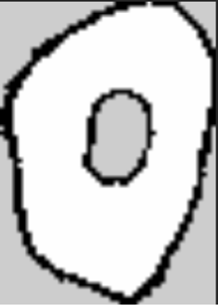
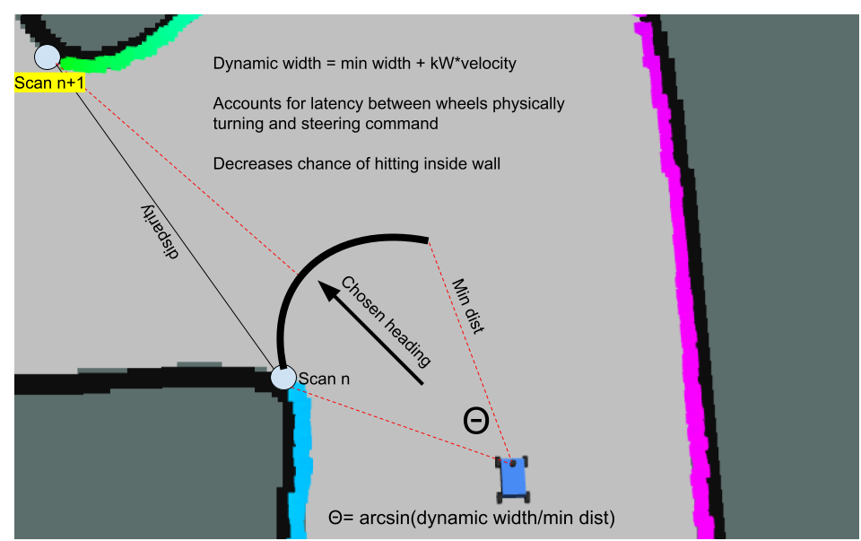

**Project**: Stanley Controller for F1Tenth Car

**Description:** GT Autonomous Vehicles VIP(part of DCSL Lab) final project.

**Dates:** Jan 26 \- May 26

**Technologies:** Python, Ros2, AMCL, SLAM

<b>Repo:</b> <a href="https://github.com/tejusk2/f1tenthwork" target="_blank">https://github.com/tejusk2/f1tenthwork</a>

---

This class, led by PhD students from the decision and control system laboratory at Tech, has introduced me to autonomous robotics and the ROS2 framework for programming mobile robots. Throughout the course so far, we’ve learned the ROS2 structure, mapping with SLAM, particle filter localization, reactive control using the disparity extender algorithm, and path following techniques. The course’s deliverables are structured so that individual tasks are completed on the simulator and group tasks are done on a physical small car equipped with a Jetson, LiDAR, and a camera(F1Tenth competition car).

Our very first deliverable was to have the physical car respond to a sensor input. Once I had set up ROS and the simulator, I pretty easily made a node to stop the car when it detected a wall in front.

A lot of this semester was spent building up the basics of autonomous robotics. For our second deliverable, we spent some time tuning gain parameters on the car to make odometry more accurate, and then we used SLAM toolbox to generate a map of an environment we set up

Then, we used AMCL to localize our car as we drove around a map. We tuned the AMCL and SLAM parameters by looking through the NAV2 docs. I learned a lot about all the different parameters of AMCL filtering and how changing the values affected how localization worked. For example, we increased the weight to z-hit and decreased the weight of z-rand because we trusted that our LiDAR scans were clean and matched closely to the predicted scan from the map because we had a high quality sensor. After a couple rounds of tuning, we got good enough performance to use for our path following algorithm.

After learning about mapping and localization, we moved on to control. I developed a disparity extender reactive control algorithm and achieved really good performance in the simulator. 

Finally, for the last project of the semester, we were to take everything we had learned and combine to develop a path following algorithm. I chose to implement a Stanley controller that followed the path generated by the DCSL path optimization program. I implemented the algorithm from the original stanley paper and added some improvements: an IIR low pass filter and a damping term to prevent oscillation in steering.

<iframe width="100%" height="315" style="align-self: center;" src="https://www.youtube.com/embed/oFAiAzrRQd4?si=LyMcWldb_tw7BCfx" title="YouTube video player" frameborder="0" allow="accelerometer; autoplay; clipboard-write; encrypted-media; gyroscope; picture-in-picture; web-share" referrerpolicy="strict-origin-when-cross-origin" allowfullscreen></iframe>